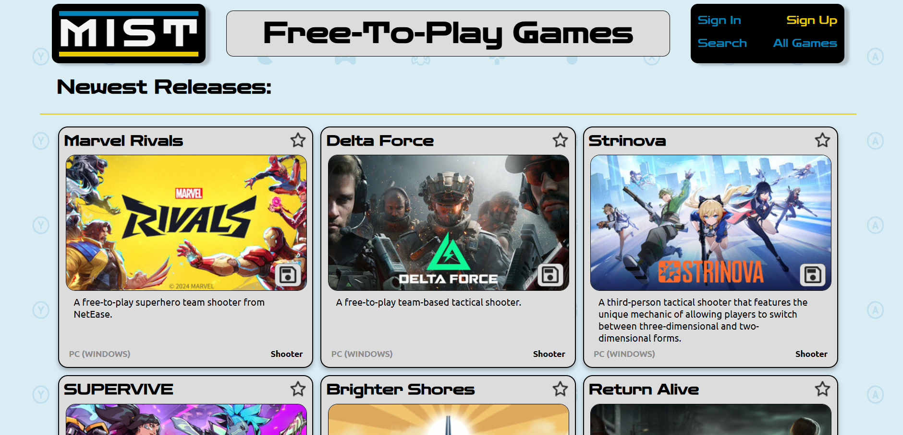

# MIST

[M I S T.com](https://mist.port0.org/)

## Overview

- Frontend Link
- Backend Link
- Game API
- Recent Updates
- Preview Images
- Future Updates

### Frontend

[Frontend Repo](https://github.com/Weaver17/Mist-frontend)

### Backend

[Backend Repo](https://github.com/Weaver17/Mist-backend)

### Free to Game API

[FreetoPlay's free API](https://www.freetogame.com/api-doc)

**Recent Updates**

- Backend server!
- Download page redirect to game site
- Click on a game to get more info

**About**

This application for any gamer into PC gaming, and anyone who likes free stuff(Microtransactions pending)! An API call is made to freetogame.com/api and free-to-play games are displayed in various ways, from recent releases to sorting by genre. Users can register and log in to save games they have played, or favorite ones they really enjoyed!

**Preview Images**

Desktop-

**Features**

- **React**: Component-based architecture for building user interfaces.
- **HTML, CSS, JavaScript**: Core web technologies for structure, styling, and interactivity.
- **Vite**: A fast build tool for a streamlined development workflow.
- **Express.js**: Backend framework for API interaction (integrated in development).
- **Node.js**: Runtime for executing JavaScript on the server.
- **Mongoose**: Object Data Modeling (ODM) library for MongoDB.

**Future Updates**

- Dynamically render faves and saves to update on any click
